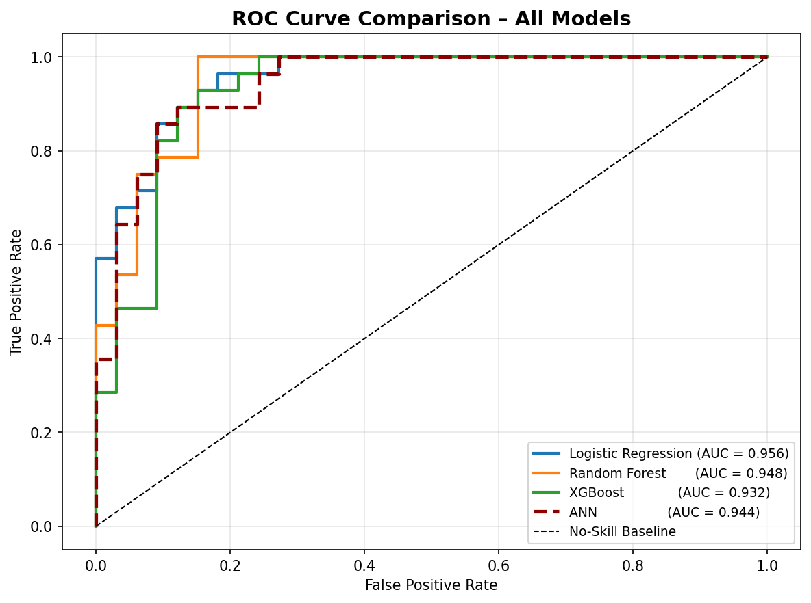

# ❤️ Heart Disease Prediction System

## Artificial Neural Network (ANN) Based Binary Classification System 

## 📌 Project Overview


The **Heart Disease Prediction System** is a Machine Learning based application that predicts whether a patient has heart disease or not based on medical attributes.

The system uses an **Artificial Neural Network (ANN)** implemented from scratch using **NumPy** for binary classification.

The project also compares ANN performance with traditional Machine Learning models:

- Logistic Regression
- Random Forest
- XGBoost


The final system contains:

- Machine Learning backend
- Data preprocessing pipeline
- ANN model training
- Model evaluation
- Interactive Streamlit user interface


---

# 🎯 Project Objectives


The main objectives of this project are:


- Predict heart disease risk from patient medical data
- Build an ANN classifier without using deep learning frameworks
- Compare ANN with traditional ML algorithms
- Analyze model performance using evaluation metrics
- Provide a simple user-friendly prediction interface


---

# ✨ System Features


## 🧠 Machine Learning Backend


The backend performs the complete ML workflow:


✅ Dataset loading  
✅ Data cleaning  
✅ Missing value handling  
✅ Data encoding  
✅ Feature scaling  
✅ ANN implementation  
✅ Model training  
✅ Model evaluation  
✅ Model comparison  


---

# 📊 Dataset Information


The system uses the Cleveland Heart Disease dataset.


The dataset contains medical attributes such as:


### Patient Information

- Age
- Sex


### Medical Measurements

- Resting Blood Pressure
- Cholesterol
- Maximum Heart Rate
- ST Depression


### Clinical Attributes

- Chest Pain Type
- Fasting Blood Sugar
- Resting ECG
- Exercise Induced Angina
- Slope
- Number of Major Vessels
- Thalassemia


Target:


```
0 → No Heart Disease

1 → Heart Disease
```


---

# ⚙️ Data Preprocessing


The preprocessing pipeline includes:


## Missing Value Handling


Missing values represented by:


```
?
```


are converted into NaN values.


---

## Numerical Feature Processing


Numerical columns:


```
age
trestbps
chol
thalach
oldpeak
```


Missing values are replaced using median values.


---

## Categorical Feature Processing


Categorical features are filled using mode values.


One-hot encoding is applied to categorical columns.


---

## Feature Scaling


StandardScaler is used:


```
Mean = 0

Standard Deviation = 1
```


This improves ANN training performance.


---

# 🧠 Artificial Neural Network Implementation


The ANN model is implemented manually using **NumPy only**.


No TensorFlow or PyTorch is used.


---

# 🏗️ ANN Architecture


```
Input Layer

20 Neurons

      ↓

Hidden Layer 1

32 Neurons

ReLU Activation

      ↓

Hidden Layer 2

16 Neurons

ReLU Activation

      ↓

Output Layer

1 Neuron

Sigmoid Activation

```


---

# 🔥 Activation Functions


## ReLU


Used in hidden layers:


```
f(x)=max(0,x)
```


---

## Sigmoid


Used for final binary classification:


```
0 → No Disease

1 → Disease
```


---

# 🔄 Training Process


The network is trained using:


## Mini Batch Gradient Descent


Parameters:


```
Epochs = 300

Learning Rate = 0.001

Batch Size = 32
```


Loss function:


```
Binary Cross Entropy
```


---

# 📈 Model Evaluation


The system evaluates models using:


## Accuracy


Measures correct predictions.


---

## Precision


Measures correctly predicted positive cases.


---

## Recall


Measures detected disease cases.


---

## F1 Score


Balance between precision and recall.


---

## ROC-AUC


Measures classification capability.


---

# 🔍 Model Comparison


The ANN model is compared with:


| Model |
|---|
| Logistic Regression |
| Random Forest |
| XGBoost |
| ANN |


Comparison includes:


- Accuracy
- Precision
- Recall
- F1 Score
- ROC-AUC


---

# 🌐 Streamlit User Interface


A Streamlit frontend was created to allow users to interact with the trained models.


The UI allows users to enter patient details and receive a prediction result.


---

# 🖥️ UI Features


Users can enter:


### Patient Details


- Age
- Gender


### Medical Information


- Blood pressure
- Cholesterol level
- Heart rate


### Clinical Information


- Chest pain type
- ECG result
- Exercise induced angina
- Other medical indicators


The system outputs:


```
Heart Disease Prediction Result
```


Example:


```
❤️ High Risk: Heart Disease Detected

or

💚 Low Risk: No Heart Disease
```


---

## Prediction Result Screen

```
```





---

# 🏗️ System Architecture


```
              Patient Dataset

                    ↓

          Data Preprocessing

                    ↓

          Feature Engineering

                    ↓

        ANN Classification Model

                    ↓

        Model Evaluation

                    ↓

          Saved Model Files

                    ↓

            Streamlit UI

                    ↓

          Prediction Result

```


---

# 📂 Project Structure


```
Heart-Disease-Prediction

│
├── data
│   │
│   └── Heart_disease_cleveland_new.csv
│
│
├── models
│   │
│   ├── ann_model.pkl
│   ├── scaler.pkl
│   └── feature_names.pkl
│
│
├── notebook
│   │
│   └── heart_disease_ann.ipynb
│
│
├── streamlit_app
│   │
│   └── app.py
│
│
├── assets
│   │
│   ├── banner.png
│   ├── streamlit_home.png
│   └── prediction_result.png
│
│
├── requirements.txt
│
└── README.md

```


---

# 🛠️ Technologies Used


## Programming Language

- Python


## Machine Learning

- NumPy
- Scikit-learn
- XGBoost


## Data Processing

- Pandas


## Visualization

- Matplotlib
- Seaborn


## Frontend

- Streamlit


## Development Environment

- Google Colab
- Visual Studio Code


---

# ⚙️ Installation


Clone repository:


```bash
git clone https://github.com/yourusername/Heart-Disease-Prediction.git
```


Move into folder:


```bash
cd Heart-Disease-Prediction
```


Install dependencies:


```bash
pip install -r requirements.txt
```


---

# ▶️ Run Backend


Open:


```
notebook/heart_disease_ann.ipynb
```


Run all cells.


The notebook will:


1. Load dataset
2. Preprocess data
3. Train ANN model
4. Compare ML models
5. Save trained components


---

# ▶️ Run Streamlit Application


Navigate:


```bash
cd streamlit_app
```


Run:


```bash
streamlit run app.py
```


The application will open in browser.


---

# 🚀 Future Improvements


Future enhancements:


- Deploy application online
- Add patient history database
- Add user authentication
- Improve ANN architecture
- Add explainable AI (SHAP)
- Add mobile application support


---

# 👩‍💻 Author

Built ❤️ by <a href="https://github.com/IleeshaUdari"><strong>M.G.Ileesha Udari Sasmitha</strong></a>

---

# ⭐ Support


If you found this project useful, give the repository a star ⭐
